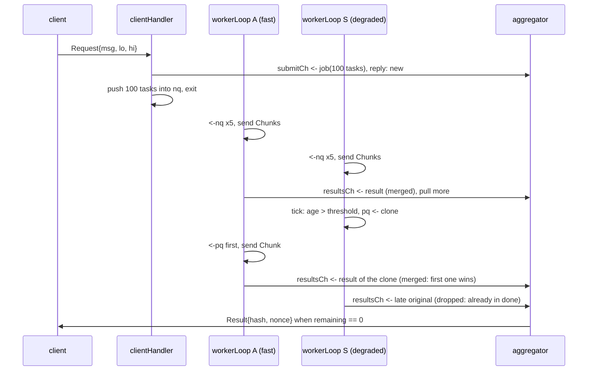

# Architecture

This document explains how the system is put together and, more importantly,
why. It is written for an engineer who wants to change the code without
breaking the properties it relies on.

- [The one idea](#the-one-idea)
- [Roles and topology](#roles-and-topology)
- [Transport layer](#transport-layer)
- [Scheduling layer](#scheduling-layer)
- [End-to-end exactly-once](#end-to-end-exactly-once)
- [Failure handling](#failure-handling)
- [Surviving a server restart](#surviving-a-server-restart)
- [Concurrency discipline](#concurrency-discipline)
- [Invariants](#invariants)
- [Parameters](#parameters)
- [Observability](#observability)

## The one idea

Two things go wrong in a cluster that talks over UDP: packets get lost, and
nodes get slow or die. The design gives each problem to exactly one layer and
forbids the layers from knowing about each other.

```
  scheduling layer   knows: task, worker, job, task-level SRTT, straggler
  (server only)      never sees: seq, Ack, RTO, retransmission
  ------------------------------------------------------------------------
  transport layer    knows: seq, Ack, window, RTO, epoch
  (all binaries)     never sees: task, job, client, worker; never reads a payload
  ------------------------------------------------------------------------
  UDP socket         loses, duplicates and reorders datagrams
```

What this buys:

- The scheduler contains no branch that mentions a sequence number. A
  retransmission is invisible to it.
- The transport does not know what a task is, so client, server and worker
  link the same library.
- The two failure modes are measured separately: loss shows up as
  retransmissions, slowness shows up as task-level round-trip time.

There is exactly one place where the upper layer reads a lower-layer
parameter: a `workerLoop` never has more than `window` tasks in flight, where
`window` is the transport's send window. That keeps in-flight work provably
bounded, and (on a loss-free path) means a worker connection never queues a
write.

## Roles and topology

Three binaries in a star. Clients and workers talk only to the server, so the
server is the only place that makes scheduling decisions.

| Role | Count | Does |
|---|---|---|
| client | many, short-lived | sends one `Request{msg, lo, hi}`, waits for one `Result` |
| server | exactly one | splits, schedules, aggregates |
| worker | many, may join, slow down or vanish at any time | announces itself with `Join`, then answers every `Chunk` with a `ChunkResult` |

Message layouts are in [wire-format.md](wire-format.md).

## Transport layer

### Contract

`rudp` promises less than TCP on purpose:

- **at least once**: every message handed to `Write` reaches the peer's `Read`
  while the connection lives;
- **any order**;
- **possibly more than once**.

It does not reorder and it does not de-duplicate. The receive path is three
steps: reset the silence counter, append the payload to the hand-off queue,
send an Ack. There is no expected-sequence counter and no reorder buffer
anywhere on the default path.

Why: with in-order delivery, one lost packet holds back every packet behind
it until the retransmission arrives (head-of-line blocking). For this system
that means one lost `ChunkResult` freezes the other results of the same
worker; the scheduler sees a full window, stops handing that worker new
chunks, and the worker idles. Since the layer above does not care about order
(see [End-to-end exactly-once](#end-to-end-exactly-once)), ordering would cost
throughput and buy nothing. `docs/benchmarks.md` puts a number on it using
`Params.OrderedDelivery`, a benchmark-only switch whose whole implementation
is `rudp/ordered.go`.

### Goroutines

A client or worker process has one socket, one connection, and two goroutines:
a `readLoop` parked in the blocking socket read and a `mainLoop` that owns the
connection.

The server has one UDP port, therefore one socket, therefore **one**
`readLoop` for the whole process: several goroutines reading the same socket
would receive packets at random and have to forward them anyway. The
`readLoop` looks at the packet's connection ID and passes it to that
connection's `mainLoop`. State stays per connection, so a worker whose link is
dropping packets keeps only its own `mainLoop` busy.

```
 3 clients + 5 workers  ->  8 connections  ->  1 readLoop + 8 mainLoops
```

The recurring trick: a call that blocks and cannot be put in a `select` gets a
dedicated goroutine whose only job is to block there and turn the result into
a channel message. `readLoop` does this for the socket read, the scheduler's
`dispatcher` does it for `Server.Read()`. Everyone else can then wait on
several things at once.

### mainLoop

One `select`, five cases. They are alternatives, not steps; whichever is ready
first runs, and none of the handlers block.

| Case | Trigger | Action |
|---|---|---|
| `<-inCh` | readLoop routed a packet here | reset `epochsSilent`. Ack: sample RTT unless retransmitted, delete from `sendBuffer`, refill the window from `pendingWrites`. Data: append to `deliverQ`, send Ack (duplicates too). Close: end the connection. |
| `<-writeReqCh` | application called `Write` | append to `pendingWrites`, then move as much as fits into the window |
| `out <- next` | application's `Read` is ready | pop the head of `deliverQ`. `out` is nil while `deliverQ` is empty, which disables the case. |
| `<-ticker.C` | an epoch passed | retransmit what has timed out, send a heartbeat if the epoch was silent, count the silence, give up at `epochLimit` |
| `<-closeCh` | application called `Close` | flush, send Close, end |

**Why `Write` must not wait for the window.** If `Write` returned only once a
window slot was free, the mainLoop would be stuck in the write case, would
never get back to the packet case, the Ack that frees the slot would never be
processed, and the window would never open: a deadlock. This is a consequence
of one goroutine serving all cases, not a performance choice. So `Write` hands
the payload over and returns; if the window is full the payload waits in
`pendingWrites`.

### Three containers

The shape of each container is the argument for it.

| Container | Type | Why this shape |
|---|---|---|
| `sendBuffer` | `map[seq]*outMsg`, at most `window` entries | Acks arrive in any order; `delete(sendBuffer, seq)` needs random access and order means nothing here. |
| `pendingWrites` | `[][]byte`, FIFO, unbounded | Append at the tail, take from the head; nothing is ever looked up. Bounded in practice by the application's send rate. |
| `deliverQ` | `[]delivery`, arrival order | Exists only because the mainLoop must not block waiting for the application to call `Read`. Its order is the order packets arrived in: seq 7 before seq 6 if 7 came first. |

Channels are not in this table: they move events into the mainLoop, they do
not hold state.

### Timers

| Mechanism | Rule | Why |
|---|---|---|
| Epoch | one ticker per connection, 20 ms | one scan of `sendBuffer` per epoch instead of a timer per message; the scan is bounded by the window |
| RTO | per message. Initial value `max(2 x SRTT, 1 epoch)`, or 2 epochs before the first sample. Doubles on every retransmission, capped at `maxBackoff` (8) epochs. | exponential backoff: do not push harder on a path that is already failing |
| SRTT | `0.875 x SRTT + 0.125 x sample` | one outlier does not move the RTO much |
| Karn's rule | the Ack of a retransmitted message is not sampled | it could be answering either transmission |
| Window | at most `window` unacknowledged messages, counted, not a sequence range | out-of-order Acks free slots immediately |
| Heartbeat | if a connection sent nothing during an epoch, it sends `Ack{seq=0}` at the tick | without it, a client quietly waiting for its Result would be declared lost after 100 ms |
| Silence | any packet resets `epochsSilent`; at `epochLimit` (5) the connection is lost | the only failure detector in the system |

This is flow control, not congestion control: the window is fixed.

### Connecting and closing

The client sends `Connect` (connection ID 0) every epoch until it receives a
`ConnAck` with its ID, or gives up after `epochLimit` epochs. The server
de-duplicates `Connect` by remote address, so a retry gets the same ID back.

`Close()` flushes first: the mainLoop keeps retransmitting until everything
written before the call has been acknowledged, or until the peer proves to be
gone. Then it sends one best-effort `Close` packet so the peer does not have to
wait out the silence timeout.

When a connection ends on its own, the mainLoop **closes `dead` first** and
only then blocks to hand its backlog and the error to `Read`. From the moment
`dead` is closed nobody can be blocked on that goroutine, so this one blocking
send is safe.

### Handles instead of lookups

The application is given a `ConnHandle`, which contains the connection's
channels, rather than a connection ID. Writing goes straight into the
connection's channel; nothing has to look the connection up. That is what
allows the connection table to belong to the `readLoop` alone.

## Scheduling layer

Four kinds of goroutine, all on the server.

| Goroutine | Count | Blocks on | Owns |
|---|---|---|---|
| `dispatcher` | 1 | `srv.Read()` | the worker and client tables |
| `clientHandler` | 1 per request, short-lived | `nq` when it is full | nothing. Asks the aggregator whether the job ID is new; only then splits and feeds `nq` |
| `workerLoop` | 1 per worker | its `select` | that worker's `inflight` map and task-level SRTT |
| `aggregator` | 1 | its `select` | `done`, `jobs`, stored answers, the write-ahead log |

Total on a server with C clients and M workers:
`(1 + C + M + 1) + (1 + C + M)`; with 3 clients and 5 workers that is 19.
Nearly all of them are parked on a channel or the socket at any moment, which
is the normal state for a goroutine and the wrong state for a pooled thread.

### dispatcher

`Server.Read()` does not distinguish connections, so one goroutine reads and
forwards. A connection's first message decides what it is: `Join` starts a
`workerLoop`, `Request` starts a `clientHandler`. `ChunkResult`s are forwarded
to the owning `workerLoop`. Every branch is idempotent because the transport
may deliver anything twice. The dispatcher never does anything that can block
for long; splitting a job can (a full `nq`), so that is delegated.

### Pull, not push

A push scheduler has to answer "which worker gets this chunk", which means
estimating each worker's speed, keeping that estimate fresh, and rebalancing
when it was wrong. Here nobody answers that question. A `workerLoop` takes a
task whenever `len(inflight) < window`. Fast workers empty their window sooner
and come back sooner; slow ones stop pulling. The split between workers is an
outcome, not a decision, and it follows a worker that is throttled, moved or
starved of CPU without any configuration.

Two queues:

| Queue | Type | Holds |
|---|---|---|
| `nq` | `chan Task`, capacity 4096 | tasks not handed out yet. When it is full the `clientHandler` blocks, which is the backpressure that stops a huge request from unfolding into memory. |
| `pq` | `chan Task`, capacity `maxWorkers x window` | clones of stragglers, and tasks handed back by lost workers. Always pulled first. |

"Pulled first" needs care in Go. A two-way `select` picks at random when both
channels are ready, so urgent re-issues would wait behind ordinary tasks half
the time. The loop therefore first tries `pq` without blocking, and only then
waits on both. Closing the pull cases when the window is full is done by
leaving the channel variables nil.

### Stragglers

Each `workerLoop` has its own 10 ms ticker and scans its own `inflight`. A
task older than `max(3 x SRTT, 50 ms)` is cloned into `pq` with a non-blocking
send and marked `speculated`, so it is cloned at most once. If `pq` is full
the entry stays unmarked and is retried at the next tick; a live worker never
waits on `pq`. There is no global ticker goroutine reaching into other
goroutines' maps, which is why `inflight` needs no lock.

Details that matter:

- The SRTT here is task-level (hand-out to result) and per worker. Until a
  worker has produced one sample nothing is speculated.
- Results of speculated tasks are not sampled, for the same reason Karn's rule
  exists below: otherwise a degraded worker teaches its own SRTT to tolerate
  the degradation and hedging turns itself off.
- A worker that is slow from its very first chunk calibrates to its own pace
  and is not speculated against. Pull-based balancing already gives it little
  work; what remains is a tail of at most one window of its chunks.
- There is **no cancel message**. The loser of a speculation is never told.
  A cancel is itself a UDP message that can be lost and would need its own
  retransmission and timeout; recomputing one chunk is cheaper.

### aggregator

De-duplicate, merge, decrement `remaining`, and reply when it reaches zero:
these four steps are one critical section. Instead of guarding them with a
lock they simply all happen in one goroutine. Every `workerLoop` drops its
results into `resultsCh` and is done. The aggregator is not a bottleneck: a
result stands for a whole chunk of computation and costs two map operations
and a comparison to process.

The aggregator only ever calls `Workload.Merge` and `Workload.Zero`. It does
not know what a hash is.

### One request, step by step



## End-to-end exactly-once

Neither layer provides exactly-once on its own. Together they do.

- The transport delivers every message at least once, in any order.
- The aggregator counts each `TaskID` once (`done`), and combines results with
  the workload's `Merge`, which must be commutative, associative and
  idempotent.

Repetition has four sources: the transport re-delivering a message whose Ack
was lost, a speculative clone finishing alongside its original, a task being
recomputed after its worker died, and a task being recomputed after a server
restart because its log record had not reached the disk. All four produce a second result for
a `TaskID` that `done` already contains, and it is dropped. Reordering is
harmless because `Merge` is commutative and associative. So each chunk is
counted exactly once, independent of arrival order and of how many times it
was computed or delivered.

Hash search is the cleanest example: `Merge` is a minimum. The same holds for
any job that splits into independent ranges and folds with such a merge:
parameter sweeps that keep the best score, fuzzing campaigns that keep the
smallest failing input, render farms where a tile's pixels are a pure function
of its coordinates. `workload/hashsearch` checks the three properties with
`testing/quick`; a new workload should do the same, because the whole
"deliver on arrival" decision rests on them.

The other receivers are idempotent too: the dispatcher ignores a repeated
`Join` or `Request`, a `workerLoop` ignores a result for a task it no longer
has in flight, and a worker that sees the same `Chunk` twice simply computes
and answers it twice.

## Failure handling

Every failure folds into a mechanism that already exists.

| Event | What happens |
|---|---|
| A packet is lost anywhere | The transport retransmits; the scheduler never notices. A retransmission may deliver a message twice; every receiver is idempotent. |
| A worker vanishes | Its connection goes silent for `epochLimit` epochs and `srv.Read()` reports it. The dispatcher closes that worker's `dead` channel and forgets it. The `workerLoop` pushes every in-flight task into `pq` and exits. Tasks that had in fact finished get recomputed; the aggregator drops the second result. |
| A worker joins | The dispatcher starts a `workerLoop`, which immediately pulls. Nothing is rebalanced. |
| A worker slows down | Its own ticker clones its overdue tasks into `pq`. The original stays where it is; whichever result reaches the aggregator first counts. |
| A client vanishes | The dispatcher tells the aggregator, which detaches the client and starts a grace period (`jobGraceMs`). If the client reconnects and sends the same job ID it is attached again and nothing was lost; this also covers a client that was only *declared* lost after a run of dropped heartbeats. Otherwise the job and its `done` entries are deleted, its feeder stops, and results that arrive later find no job and are dropped. |
| The server dies | With `-wal` set, a restarted server rebuilds its jobs from the log and carries on; see the next section. Without it, everything is lost. |

A straggler and a dead worker end in the same action, "put the task in `pq`".
The only difference is whether the original copy still exists.

## Surviving a server restart

Jobs are identified by a 64-bit ID that the client chooses, not by the
client's connection, so a job still means something after the connection, or
the server process, is gone. With `-wal <file>` the aggregator appends four
kinds of record to a write-ahead log (`wal/`): `JobStart` (the request and the
chunk width actually used), `ChunkDone` (one counted result), `JobDone` (the
answer) and `JobDrop`. The log has one owner, the aggregator, like everything
else.

On start, `sched.New` replays the log with the same fold the aggregator runs
live: de-duplicate by TaskID, `Merge`, count down. Unfinished jobs get a
feeder that queues only the chunks the log does not already account for.
Workers reconnect on their own, and the client resubmits its job ID and is
attached to the recovered job. The replayed log is then rewritten as the
shortest history that yields the same state.

**Durability is an optimisation here, not a correctness requirement**, and
that is the same argument that lets the transport skip de-duplication, pushed
one layer further down:

- A `ChunkDone` lost in a crash means that chunk is computed and merged again.
  `Compute` is deterministic and `Merge` is idempotent, so the answer is the
  same. Chunk records are therefore buffered and synced every 50 ms, not per
  record; a crash costs at most 50 ms of recomputation.
- A `JobStart` lost in a crash is repaired by the client, which still holds
  the request and resubmits it.
- A Result sent just before a crash that lost its `JobDone` is recomputed from
  the surviving chunk records to the same value.

`JobStart` and `JobDone` are synced immediately anyway, because they are rare
and save the most work. Every record is framed with its length and a CRC-32;
replay stops at the first frame that is truncated or fails its checksum, which
is what a crash in the middle of a write leaves behind, and the file is cut
there. A test truncates a log at every byte offset and checks that replay
always yields a prefix.

What this does not give: availability. There is still one server; while it is
down nothing progresses. The log makes a restart cheap, it does not remove the
need for one.

## Concurrency discipline

Go offers three ways to protect state: confine it to one goroutine, hand it
over a channel, or lock it. This code base uses only the first two.

| State | Sole owner |
|---|---|
| `sendBuffer`, `pendingWrites`, `deliverQ`, sequence counter, SRTT, `epochsSilent` | that connection's `mainLoop` |
| connection table, address table | the server's `readLoop` |
| worker table, client table | `dispatcher` |
| `inflight`, task-level SRTT | that worker's `workerLoop` |
| `done`, `jobs`, stored answers, the write-ahead log | `aggregator` |
| every metric series | the metrics collector goroutine |
| RNG and delay heap of a simulated network | that `lossy.Conn`'s goroutine |

Non-test code imports nothing from `sync` or `sync/atomic`; CI greps for it.
The only thing read concurrently by several goroutines is `Task.Msg`, a Go
`string`, whose immutability is enforced by the compiler rather than by
convention. A `Task` is a value, so handing one to another goroutine, or
cloning one for speculation, is an assignment.

**Sends to goroutines that may have ended.** Every such send is a `select`
with a second case on a channel that the receiver closes when it ends
(`dead`, `stop`, `done`). Examples: `ConnHandle.Write`, the read loop's hand-off
to a `mainLoop`, a `workerLoop` handing a result to the aggregator.

**Why it cannot deadlock.** Draw who waits for whom and the graph has one
direction: `readLoop -> mainLoop -> dispatcher -> workerLoop -> aggregator ->
mainLoop`. The last edge is a `Write`, and a `mainLoop` never blocks to send:
its hand-off to `Read` is one case of its `select`, enabled only when there is
something to hand over. The single exception is the final report of a lost
connection, and by then `dead` is closed and nobody waits for that goroutine.
So the chain never closes into a cycle. The only send that can block for long
is a `clientHandler` pushing into a full `nq`; that is intended backpressure,
and nothing waits for a `clientHandler`.

## Invariants

1. `len(inflight) <= window` for every worker at all times.
2. An in-flight entry is cloned into `pq` at most once (`speculated`).
3. A live worker never blocks on `pq`: clones use a non-blocking send.
4. End-to-end exactly-once: each chunk is counted once, regardless of arrival
   order or repetition.
5. Single owner: every piece of mutable state is read and written by one
   goroutine; there are no locks.
6. A worker connection's `pendingWrites` stays empty, because invariant 1
   stops the scheduler before the transport's window would. This holds while
   an Ack cannot be overtaken by the result it precedes, that is, without loss
   or reordering. If a Chunk's Ack is lost but its result arrives, one write
   can wait for a retransmission round; in-flight work is still bounded by
   invariant 1.
7. The transport never inspects a payload; the scheduler never sees a
   sequence number.

Tests assert 1, 2, 4 and 6 through hooks that run on the owning goroutine; 5
is enforced by the race detector plus the CI grep; 3 and 7 are structural.

## Parameters

Everything is a field of `sched.Params` (which embeds `rudp.Params`) and a
command-line flag.

| Name | Default | Layer | Raising it means |
|---|---|---|---|
| `window` | 5 | transport, and the scheduler's gate | more chunks in flight per worker: fewer idle gaps, but more wasted work behind a straggler |
| `epochMs` | 20 | transport | slower loss recovery, fewer timer wake-ups |
| `epochLimit` | 5 | transport | fewer false disconnects, slower detection of real ones. An idle connection survives on heartbeats alone and is falsely declared lost with probability `p^epochLimit` per epoch at loss rate `p`; raise this on bad networks. |
| `maxBackoff` | 8 epochs | transport | longer pauses on a persistently failing path |
| `chunkSize` | 10 000 nonces | splitter | less scheduling and network overhead per unit of work, a costlier straggler. Aim for a chunk that takes at least a few milliseconds: a loss stalls one window slot for an RTO (20 to 40 ms), and with very cheap chunks all five slots are often stalled at once. |
| `stragglerFactor` | 3 (x SRTT) | workerLoop | later speculation: less duplicate work, longer tail |
| `minStragglerMs` | 50 | workerLoop | floor of the straggler threshold; keeps a retransmission round from looking like a straggler |
| `tickMs` | 10 | workerLoop | slower straggler detection |
| `nqCap` | 4096 | scheduler | the splitter blocks later, more memory per large request |
| `maxWorkers` | 64 | scheduler | sizes `pq` as `maxWorkers x window`; "big enough" is all that matters |
| `wal` | off | aggregator | path of the write-ahead log; jobs survive a restart when set |
| `jobGraceMs` | 5000 | aggregator | a job waits longer for a lost client to come back; more work wasted on clients that never do |
| `resultTtlMs` | 60000 | aggregator | finished answers are kept longer for clients that ask again; more memory |

## Observability

The server exposes `/metrics` (Prometheus text format) and `/debug/pprof`.

Counting must not break the ownership rule, so nothing is incremented from two
goroutines. Each owner keeps its own cumulative counters and publishes a copy
over a channel with a non-blocking send: a `mainLoop` once per epoch when
something changed, a `workerLoop` on its tick, the aggregator after each event.
One collector goroutine owns the latest copy of each. HTTP handlers run on
their own goroutines, so they ask the collector for a snapshot over a channel.
Because the copies are cumulative, a dropped one is repaired by the next, and
the data path never waits for metrics.

| Series | Meaning |
|---|---|
| `rudp_conn_retransmits_total{conn}`, `rudp_conn_srtt_seconds{conn}` | loss and latency per connection |
| `rudp_conn_send_buffer{conn}`, `rudp_conn_pending_writes{conn}` | window occupancy and backlog |
| `rudp_data_sent_total`, `rudp_retransmits_total` | totals that survive connections ending |
| `sched_queue_depth{queue="nq"\|"pq"}` | backlog, and how much re-issued work is waiting |
| `sched_worker_inflight{worker}`, `sched_worker_utilization{worker}`, `sched_worker_task_srtt_seconds{worker}` | per-worker load and pace |
| `sched_speculations_total`, `sched_tasks_requeued_total` | hedging and recovery activity |
| `sched_results_merged_total`, `sched_results_duplicate_total`, `sched_results_orphan_total`, `sched_worker_duplicate_results_total` | the exactly-once bookkeeping, visible |
| `sched_jobs_recovered_total`, `sched_chunks_recovered_total`, `sched_requests_reattached_total`, `sched_wal_errors_total` | what a restart saved, and whether the log is healthy |
| `sched_job_latency_seconds` | histogram, registration to Result |
